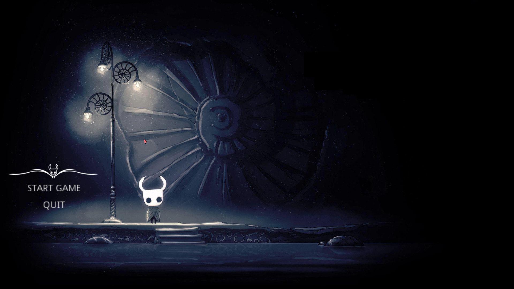

# 2D Game with GODOT and C++
# General Introduction:
This project aims to develop a 2D game using the GODOT engine and C++. The game will feature various elements such as characters, levels, and interactive objects. This README provides an overview of the project's objectives, features, and development process.

# Features:
- Creation of dynamic and interactive game elements.
- Implementation of player and enemy behaviors using GODOT's scripting capabilities.
- Design and integration of levels and game mechanics.
- User-friendly interface with menus and HUD elements.
- Integration of audio and visual effects to enhance gameplay experience.

  

